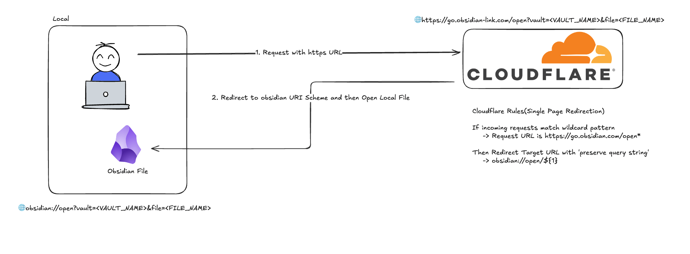

# Obsidian Link(Redirect Obsidian URL from HTTPS to Local)

Convert Obsidian's native `obsidian://` URIs to HTTPS redirect URLs for better compatibility with external platforms like Slack, Notion, and web forums.

## Overview



Many platforms (Slack, Notion, web forums) block or don't recognize Obsidian's custom `obsidian://` URI scheme. This plugin solves that problem by generating standard HTTPS URLs that redirect back to your Obsidian vault.

**How it works:**

1. Generates an `obsidian://` URI from your active file
2. Transforms it to an HTTPS URL using a configurable redirect service
3. Copies the shareable link to your clipboard

**Example transformation:**
```
Input:  obsidian://open?vault=my-vault&file=Project%2FMeeting
Output: https://go.obsidian-link.com/open?vault=my-vault&file=Project%2FMeeting
```

## Features

- **One-click link generation**: Use command palette to instantly copy shareable links
- **Customizable redirect URL**: Configure your own domain (e.g., using Cloudflare)
- **Cross-platform**: Works on both desktop and mobile
- **Proper URL encoding**: Handles special characters in vault and file names
- **Visual feedback**: Toast notifications confirm successful copy

## Installation

### From Obsidian Community Plugins (Coming Soon)

1. Open Settings → Community Plugins
2. Search for "Obsidian Link"
3. Click Install, then Enable

### Manual Installation

1. Download `main.js`, `manifest.json`, and `styles.css` from the [latest release](https://github.com/iamjjanga-ouo/obsidian-link/releases)
2. Create folder `VaultFolder/.obsidian/plugins/obsidian-link/`
3. Copy the downloaded files into this folder
4. Reload Obsidian and enable the plugin in Settings → Community Plugins

## Usage

### Copy Link to Active File

1. Open any note in Obsidian
2. Open Command Palette (`Cmd/Ctrl + P`)
3. Run command: **"Obsidian Link: Copy Link"**
4. The HTTPS redirect URL is now in your clipboard

### Configure Redirect Service

1. Go to Settings → Obsidian Link
2. Update the **Target URL** field (default: `https://go.obsidian-link.com`)
3. The plugin will automatically normalize URLs (remove trailing slashes, validate format)

**Important:** The target URL server must be configured to redirect HTTPS requests back to `obsidian://` URIs. See [Backend Setup](#backend-setup) below.

## Backend Setup

The plugin generates HTTPS URLs, but you need a redirect service to make them work. Here are two ways to set up Cloudflare:

### Quick Start (Automated Setup)

Use the Python automation script for fastest setup:

**Prerequisites:**
- Python 3.8+
- uv (Python package manager)
- Cloudflare API Token (with Zone:Edit permission)
- Cloudflare Zone ID

**Setup Steps:**

1. **Get Cloudflare credentials:**
   - API Token: Cloudflare Dashboard → My Profile → API Tokens → Create Token
   - Required permissions: Zone Settings (Read), DNS (Edit), Dynamic Redirect (Edit)
   - Zone ID: Found in your domain's API section

2. **Configure environment:**
   ```bash
   cd setup-cloudflare
   cp .env.example .env
   # Edit .env and add your CF_API_TOKEN and CF_ZONE_ID
   ```

3. **Run setup script:**
   ```bash
   ./run.sh
   # Or manually:
   uv sync
   uv run python setup_cloudflare.py
   ```

The script will automatically:
- Add DNS CNAME record (`go` → your domain)
- Create redirect rule (`https://go.your-domain.com/open?...` → `obsidian://open?...`)

### Manual Setup

For more control or if you prefer manual configuration:

#### Step 1: DNS Configuration

1. Go to Cloudflare Dashboard → DNS → Records
2. Add a CNAME record:
   - **Name:** `go`
   - **Target:** `@` (your root domain) or your hosting provider
   - **Proxy status:** Proxied (orange cloud)
   - **TTL:** Auto

#### Step 2: Redirect Rules

1. Navigate to Rules → Redirect Rules → Create rule
2. Configure the redirect:

**Rule name:**
```
Obsidian Link Redirect
```

**When incoming requests match:**
```
(http.host eq "go.your-domain.com" and http.request.uri.path eq "/open")
```

**Then:**
- Type: `Dynamic`
- Expression:
  ```
  concat("obsidian://open?", http.request.uri.query)
  ```
- Status code: `301` (Permanent Redirect)
- Preserve query string: `No` (already in expression)

**Example:**
```
Input:  https://go.your-domain.com/open?vault=MyVault&file=Notes.md
Output: obsidian://open?vault=MyVault&file=Notes.md
```

#### Step 3: Security Rules

**3.1 Rate Limiting**

Navigate to Security → Rate Limiting Rules → Create rule

**Rule name:** `Obsidian Link Rate Limit`

**When incoming requests match:**
```
(http.host eq "go.your-domain.com" and http.request.uri.path eq "/open")
```

**Configuration:**
- Action: `Block`
- Requests: `60 per 1 minute`
- Duration: `60 seconds`
- Counting: `Per IP address`
- Status code: `429 Too Many Requests`

**3.2 Query String Validation**

Navigate to Security → WAF → Custom rules → Create rule

**Rule 1: Block Long Query Strings**
```
When: (http.host eq "go.your-domain.com" and
       http.request.uri.path eq "/open" and
       len(http.request.uri.query) gt 2048)
Then: Block (400 Bad Request)
```

**Rule 2: Validate Required Parameters**
```
When: (http.host eq "go.your-domain.com" and
       http.request.uri.path eq "/open" and
       (not http.request.uri.query contains "vault=" or
        not http.request.uri.query contains "file="))
Then: Block (400 Bad Request)
```

**Rule 3: Block Invalid Paths**
```
When: (http.host eq "go.your-domain.com" and
       not http.request.uri.path eq "/open")
Then: Block (404 Not Found)
```

### Testing Your Setup

**Test normal redirect:**
```bash
curl -I "https://go.your-domain.com/open?vault=Test&file=note.md"
# Expected: 301 redirect to obsidian://open?vault=Test&file=note.md
```

**Test rate limiting:**
```bash
for i in {1..65}; do
  curl -I "https://go.your-domain.com/open?vault=Test&file=test.md"
  echo "Request $i"
done
# First 60 should succeed, then get 429 Too Many Requests
```

**Test validation rules:**
```bash
# Missing parameter (should get 400)
curl -I "https://go.your-domain.com/open?vault=Test"

# Invalid path (should get 404)
curl -I "https://go.your-domain.com/invalid"

# Long query string (should get 400)
curl -I "https://go.your-domain.com/open?vault=Test&file=$(python3 -c 'print("A"*2500)')"
```

### Monitoring

Enable Cloudflare Analytics to track:
- Request volume and trends
- Rate limit hits by IP
- Blocked requests (validation failures)
- Geographic distribution

Set up alerts for:
- Sudden spikes in rate limit blocks
- Unusual traffic patterns
- High error rates

### Using Your Own Domain

If you want to use a custom domain instead of `go.obsidian-link.com`:

1. Complete the setup steps above with your domain
2. Update plugin settings: Settings → Obsidian Link → Target URL
3. Enter your domain (e.g., `https://go.your-domain.com`)
4. The plugin will normalize the URL automatically

## Security

### Link Safety

This plugin generates secure, shareable links with the following protections:

- ✅ **XSS/Injection Protection**: Uses `encodeURIComponent()` to safely encode vault names and file paths
- ✅ **No Malicious Code Execution**: Generated links are simple Obsidian URIs that only open files
- ✅ **No Network Requests**: Plugin only generates URLs and copies to clipboard
- ✅ **Client-Side Only**: All processing happens locally in your Obsidian app

### How URL Encoding Works

The plugin uses `encodeURIComponent()` to encode vault names and file paths before generating URLs. This ensures special characters (`<`, `>`, `"`, `'`, `/`, etc.) are safely escaped, preventing malicious scripts from being injected into shared links.

**Example:**
```
File path: "Project/Meeting Notes <Draft>.md"
Encoded:   "Project%2FMeeting%20Notes%20%3CDraft%3E.md"
```

### User Guidelines

**1. Verify Link Sources**

- Only click Obsidian Link URLs from trusted sources
- Verify the domain matches your configured redirect service (default: `go.obsidian-link.com`)
- Be cautious with links from unknown senders

**2. Custom Target URL**

- If you change the **Target URL** setting from the default, ensure you trust the redirect service
- The redirect server must be properly secured (see [setup-cloudflare/README.md](./setup-cloudflare/README.md))
- Using untrusted redirect services may expose you to security risks

**3. Keep Obsidian Updated**

- Obsidian handles `obsidian://` URIs securely when up-to-date
- Regularly apply Obsidian security updates
- The plugin follows Obsidian's official URI scheme standards

### Redirect Service Security

If you're hosting your own redirect service, implement these security measures:

**Essential Security Checklist:**

- ✅ **Use HTTPS only** (never HTTP) with valid SSL certificates
- ✅ **Rate limiting** to prevent DoS attacks (recommended: 60 requests/minute per IP)
- ✅ **Parameter validation**: Require `vault` and `file` parameters
- ✅ **Query string limits**: Block requests with query strings longer than 2048 characters
- ✅ **Path restrictions**: Only allow `/open` endpoint, block all other paths
- ✅ **Monitoring and logging**: Track request patterns, blocked IPs, and error rates
- ✅ **Analytics**: Monitor traffic trends and geographic distribution

**Recommended Rate Limit Settings:**

| User Type | Requests/min | Status |
|-----------|--------------|--------|
| Normal user | 5-10 | ✅ Allowed |
| Power user | 20-30 | ✅ Allowed |
| Automated scripts | 60+ | ⚠️ Blocked |
| Malicious attacks | Hundreds | ❌ Blocked |

**Security Rule Priority:**

For Cloudflare configurations, rules execute in this order:
1. Single Redirects (redirect rules)
2. WAF Custom Rules (validation rules)

**Important:** Because redirects execute before WAF rules, path traversal patterns (`../`) in query strings cannot be validated at the redirect layer. See [Known Limitations](#known-limitations) below for details and mitigation strategies.

### Known Limitations

⚠️ **Path Traversal Validation**

Due to Cloudflare's execution order (Single Redirects run before security rules), the redirect service **cannot validate** dot-dot-slash (`../`) patterns in file paths. This means malicious links could potentially reference files outside the intended vault directory.

**User Protection:**

- ✅ Only click links from trusted sources
- ✅ Inspect the `file` parameter in URLs before clicking
- ✅ Be cautious of `../` patterns in file paths

**Risk Context:**

- Links only access your **local** Obsidian vault
- No remote code execution possible
- Limited by Obsidian's vault permissions
- Impact: Local file access only

For technical details, see [Cloudflare Security Limitations](./setup-cloudflare/README.md#-known-security-limitations).

### Security Analysis

A comprehensive security analysis is available in the project documentation:

- **Threat Analysis**: XSS, Path Traversal, SQL Injection, and other attack vectors
- **Vulnerability Assessment**: Analysis of plugin code and redirect architecture
- **Security Recommendations**: Best practices for safe deployment

### Reporting Security Issues

If you discover a security vulnerability, please report it responsibly:

- **Do not** open a public GitHub issue
- Email security concerns to: [your-email] (or open a private security advisory)
- Provide detailed information about the vulnerability
- Allow reasonable time for a fix before public disclosure

## Development

### Prerequisites

- Node.js v16 or higher
- npm or yarn

### Setup

```bash
# Clone the repository
git clone https://github.com/iamjjanga-ouo/obsidian-link.git
cd obsidian-link

# Install dependencies
npm install

# Start development mode (watch for changes)
npm run dev
```

### Testing

1. Build the plugin with `npm run dev`
2. Copy `main.js`, `manifest.json`, and `styles.css` to your test vault's `.obsidian/plugins/obsidian-link/` folder
3. Reload Obsidian and enable the plugin
4. Test the command palette command
5. Verify the clipboard contains the correct HTTPS URL
6. Test with various file paths (spaces, special characters, nested folders)

### Project Structure

```
src/
  ├── main.ts       # Plugin entry point, core logic
  └── settings.ts   # Settings interface and settings tab UI
manifest.json       # Plugin metadata
esbuild.config.mjs  # Build configuration
```

### Key Implementation Details

**URL Transformation Logic:**
- Parses vault name and file path from active file
- Builds Obsidian URI with proper URL encoding
- Appends query string to configurable target URL
- Formula: `[Target URL]/[Path]?[Query String]`

**Obsidian API Usage:**
- `this.app.workspace.getActiveFile()` - Get current active file
- `this.app.vault.getName()` - Get vault name for URI generation
- `navigator.clipboard.writeText()` - Copy to clipboard
- `new Notice()` - Show toast notifications
- `this.addCommand()` - Register command palette commands

### Code Quality

```bash
# Run ESLint
npm run lint

# Build for production
npm run build
```

## Release Process

1. Update `minAppVersion` in `manifest.json` if needed
2. Run version bump: `npm version patch|minor|major`
   - Auto-updates `manifest.json`, `package.json`, and `versions.json`
3. Build for production: `npm run build`
4. Create GitHub release with tag matching version number (no "v" prefix)
5. Upload `manifest.json`, `main.js`, `styles.css` as release assets
6. For community plugin submission, follow the [plugin guidelines](https://docs.obsidian.md/Plugins/Releasing/Plugin+guidelines)

## Troubleshooting

### Plugin Issues

**"No active file found" error:**
- Make sure you have a note open in the editor
- The plugin requires an active file to generate a link
- File must be saved (not an untitled draft)

**Special characters in file names:**
- The plugin automatically handles URL encoding via `encodeURIComponent()`
- If issues persist, check that your redirect service doesn't modify query strings
- Verify the Cloudflare redirect rule uses the correct expression

### Redirect Service Issues

**Redirect not working:**

*Possible causes:*
- Cloudflare Proxy (orange cloud) not enabled in DNS settings
- Redirect rule condition incorrectly configured
- DNS changes not yet propagated

*Solutions:*
1. Verify DNS record shows "Proxied" status (orange cloud icon)
2. Double-check redirect rule expression matches documentation
3. Test with `curl -I` to see actual HTTP response
4. Wait for DNS propagation (usually minutes, can take up to 24 hours)
5. Check rule is enabled and has correct priority (should be first)

**Link doesn't open Obsidian:**
- Verify your redirect service returns a `301` or `302` status code
- Check that the `Location` header contains `obsidian://` protocol
- Test the redirect URL directly in a browser (should show Obsidian opening)
- Verify target URL in plugin settings matches your redirect service domain
- Check that Obsidian is installed and set as handler for `obsidian://` URIs

**Normal users hitting rate limit:**

*Cause:* Rate limit setting too restrictive (60 req/min may be too low for some workflows)

*Solutions:*
- Increase limit: 60 req/min → 100 req/min
- Reduce block duration: 60 seconds → 30 seconds
- Adjust per-IP counting to per-session if supported
- Monitor Analytics to find appropriate threshold

### Automated Setup Issues

**DNS record already exists:**
- The Python script checks for existing records and skips creation
- If you need to update an existing record, delete it manually first
- Or modify the script to use update instead of create

**Script fails with API error:**
- Verify your API token has correct permissions (Zone Settings: Read, DNS: Edit, Dynamic Redirect: Edit)
- Check that Zone ID is correct for your domain
- Ensure `.env` file is properly formatted (no spaces around `=`)
- Verify you're within Cloudflare API rate limits

**Environment variables not loading:**
- Confirm `.env` file exists in `setup-cloudflare/` directory
- Check file permissions (should be readable)
- Verify `python-dotenv` is installed (`uv sync`)
- Try exporting variables manually: `export CF_API_TOKEN=...`

## Contributing

Contributions are welcome! Please feel free to submit a Pull Request.

## References

**Cloudflare Documentation:**

- [Single Redirects](https://developers.cloudflare.com/rules/url-forwarding/single-redirects/) - Configure redirect rules
- [Rate Limiting Rules](https://developers.cloudflare.com/waf/rate-limiting-rules/) - Prevent DoS attacks
- [WAF Custom Rules](https://developers.cloudflare.com/waf/custom-rules/) - Request validation

**Security Resources:**

- [OWASP URL Redirection Cheat Sheet](https://cheatsheetseries.owasp.org/cheatsheets/Unvalidated_Redirects_and_Forwards_Cheat_Sheet.html)
- [Obsidian URI Scheme](https://help.obsidian.md/Extending+Obsidian/Obsidian+URI) - Official URI documentation

**Obsidian Development:**

- [Plugin API Documentation](https://docs.obsidian.md) - Official Obsidian plugin development guide
- [Plugin Guidelines](https://docs.obsidian.md/Plugins/Releasing/Plugin+guidelines) - Community plugin submission

## License

This project is licensed under the MIT License.

## Support

- [Report issues](https://github.com/iamjjanga-ouo/obsidian-link/issues)
- [Feature requests](https://github.com/iamjjanga-ouo/obsidian-link/issues)

## Credits

Developed by [iamjjanga](https://github.com/iamjjanga-ouo)

## API Documentation

For more information about the Obsidian Plugin API, see [https://docs.obsidian.md](https://docs.obsidian.md)
